[English](README.md) | [中文](docs/README_ZH.md)

# OFBiz Drools Plugin

OFBiz Drools Plugin integrates [kie business central](https://github.com/kiegroup/kie-wb-distributions) and [kie server](https://github.com/kiegroup/droolsjbpm-integration) into [OFBiz](https://github.com/apache/ofbiz).

This plugin is developed for [SandFlower project](https://github.com/SandFlower/) to make it an OOTB IOT/RFID product for small business end users to help them design/test/deploy differential prices or commissions, or duty work schedule and etc.

In short word, this plugin is a rule calculator.

<br/>

### License
Apache License V2.0

<br/>

### Contribution
Welcome any kind of contributions to this plugin.

<br/>

### Quick Start

**1. Checkout OFBiz 17.12.03 from https://github.com/apache/ofbiz-framework**

<br/>

**2. Apply patches under patches/ofbiz to OFBiz**

<br/>

**3. Download this plugin**

<br/>

**4. Deploy this plugin in plugins/drools/**

<br/>

**5. Download gradle 5.6 and install. If you use gradlew, please edit gradle/wrapper/gradle-wrapper.properties, change to use gradle 5.6:**

```
distributionUrl=https\://services.gradle.org/distributions/gradle-5.6-bin.zip
```

<br/>

**6. Install OFBiz seed data by command:**

```
gradle loadAll
```

<br/>

**7. Start OFBiz by command:**

```
gradle ofbiz
```

<br/>

**8. In browser, visit http://localhost:8080/kie-server/services/rest/server**

Username: kieserver

Password: sandflower

After login successfully, you can see kie server information.


<br/>

**9. In browser, visit https://localhost:8443/kie-wb/**

Username: admin

Password: ofbiz

After login successfully, you can use Kie workbench now.

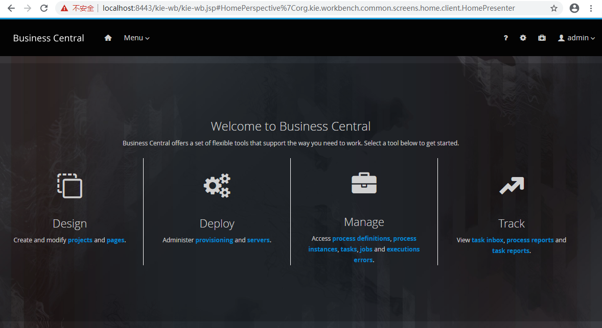

<br/>

**10. Import a sample in Design, i.e. Mortgages and deploy it.**

<br/>

**11. Add a kie-server named runtime/drools/ofbiz-kie-server in Deploy:**

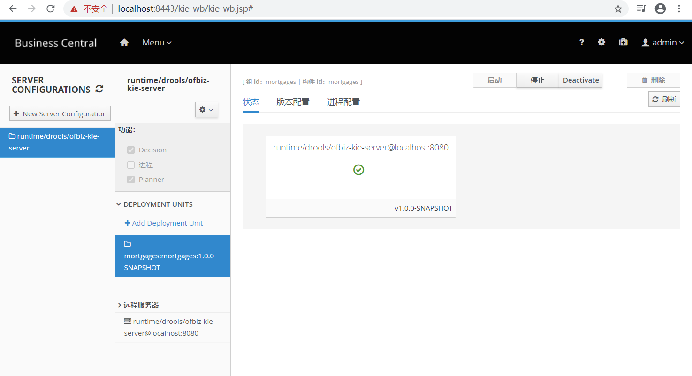

<br/>

**12. Verify any container is running by visiting http://localhost:8080/kie-server/services/rest/server/containers:**

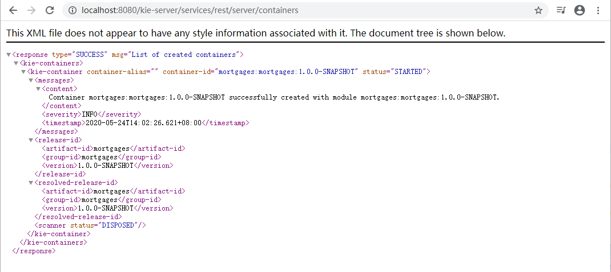

and check a specific container status, i.e. mortgages:mortgages:1.0.0-SNAPSHOT, by http://localhost:8080/kie-server/services/rest/server/containers/mortgages:mortgages:1.0.0-SNAPSHOT:

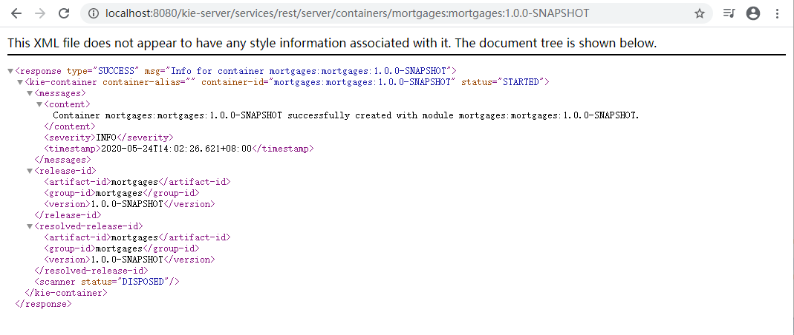

<br/>

**13. Call rules in a kie-server container in postman:**

13.1. Set Auth to Basic Auth, Username: kieserver, Password: sandflower

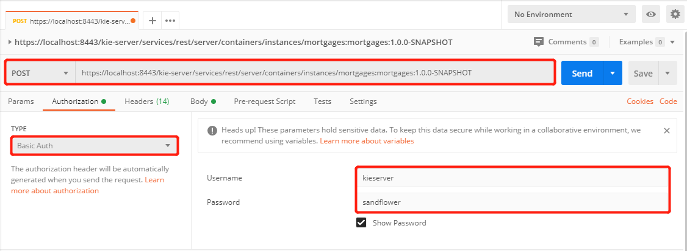

<br/>

13.2. Set Headers with Content-Type: application/json, X-KIE-ContentType: JSON, Accept: application/json

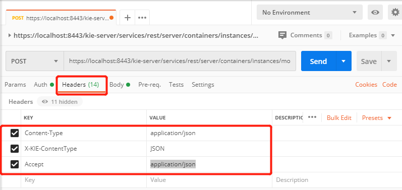

<br/>

13.3. Set Body in the post:

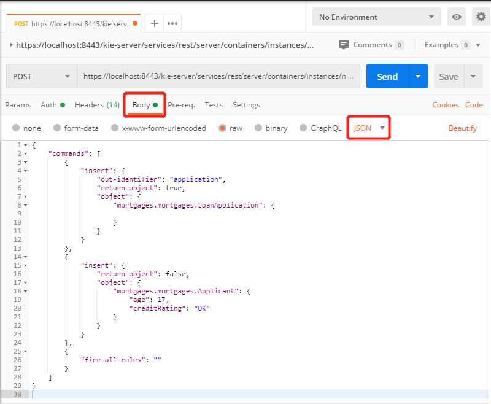

<br/>

13.4. Send the post request and get rule result

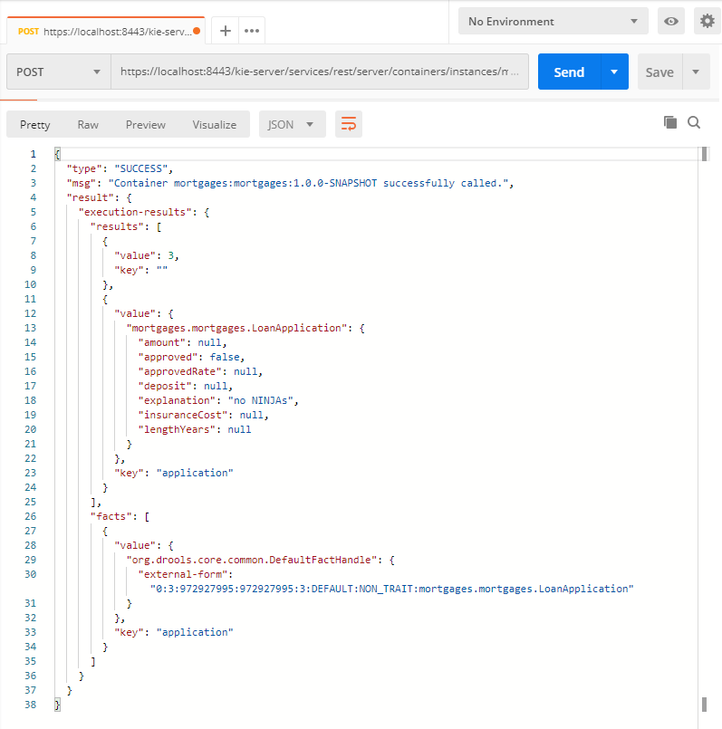

<br/>

### Development Notes

**1. How to build webapp/business-central-7.17.0.Final for this plugin**

1.1. Apply kie/business-central-distribution-wars-7.17.0.Final.patch to [kie-wb-distributions/business-central-parent/business-central-distribution-wars/](https://github.com/kiegroup/kie-wb-distributions/tree/7.17.0.Final/business-central-parent/business-central-distribution-wars)

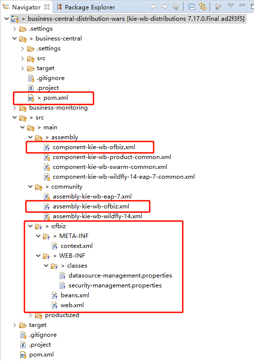

<br/>

1.2. Run mvn clean package to build target/business-central-7.17.0.Final-ofbiz, it's the webapp/business-central-7.17.0.Final in this plugin

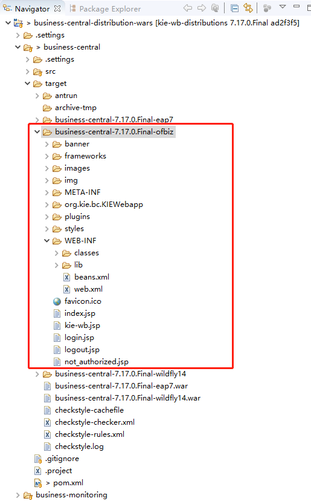

<br/>

**2. How to build webapp/kie-server-7.17.0.Final for this plugin**

2.1. Apply kie/kie-server-7.17.0.Final.patch to [droolsjbpm-integration/kie-server-parent/kie-server-wars/kie-server/](https://github.com/kiegroup/droolsjbpm-integration/tree/7.17.0.Final/kie-server-parent/kie-server-wars/kie-server)


<br/>

2.2. Run mvn clean package to build target/kie-server-7.17.0.Final-ofbiz, it's the webapp/kie-server-7.17.0.Final

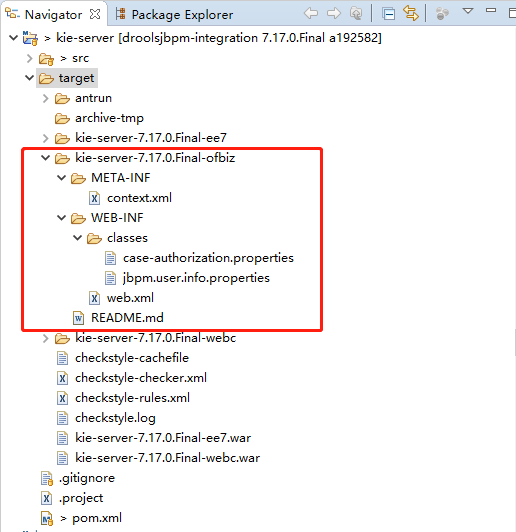

<br/>

**3. Why apply patches/ofbiz/startup-with-webapp-context.xml.patch**

As you see, when deploying kie-drools-wb or kie-server in tomcat, the META-INF/context.xml is applied. In OFBiz 17.12.03, it's not. With patches/ofbiz/startup-with-webapp-context.xml.patch, META-INF/context.xml is configured, and then authz and taglibs can work as expected:

```java
         StandardContext context = new StandardContext();
+        String location = getWebappRootLocation(appInfo);
+
+        String contextXmlFilePath = new StringBuilder().append("file:///").append(location).append("/").append(Constants.ApplicationContextXml).toString();
+        URL contextXmlUrl = null;
+        try {
+            contextXmlUrl = FlexibleLocation.resolveLocation(contextXmlFilePath);
+            contextXmlFilePath = new StringBuilder().append(location).append("/").append(Constants.ApplicationContextXml).toString();
+            File contextXmlFile = FileUtil.getFile(contextXmlFilePath);
+            if(contextXmlFile.exists() && contextXmlFile.isFile()) { 
+                Debug.logInfo(contextXmlFilePath + " found and will be loaded.", module);
+                context.setConfigFile(contextXmlUrl);
+            } else {
+                // Debug.logInfo(contextXmlFilePath + " not found or not a file.", module);
+            }
+        } catch (MalformedURLException e) {
+            Debug.logInfo(contextXmlFilePath+ " not found.", module);
+        }
+
         Tomcat.initWebappDefaults(context);
 
-        String location = getWebappRootLocation(appInfo);
```

context.setConfigFile(contextXmlUrl) is the core line.

<br/>

**4. Why apply patches/ofbiz/build.gradle.patch**

In this patch, rootProject.jvmArguments is exposed to submodule's build.gradle to extend or change them:

```groovy
-List jvmArguments = ['-Xms128M', '-Xmx1024M']
+ext.jvmArguments = ['-Xms128M', '-Xmx1024M']
```

and then in the build.gradle of OFBiz-Drools plugin, the rootProject.jvmArguments are extended:

```groovy
rootProject.jvmArguments.each { jvmArg ->
    if (jvmArg && jvmArg.startsWith("-Dlog4j.configurationFile=")) {
        originalLog4jConfig = jvmArg
        if (!jvmArg.endsWith("=")) {
            jvmArg += ","
        }
        log4jConfig = jvmArg + "log4j2-drools.xml"
        findLogArg = true
        return true
    }
}
if (!findLogArg) {
    rootProject.jvmArguments.add('-Dlog4j.configurationFile=log4j2.xml,log4j2-drools.xml')
} else {
    rootProject.jvmArguments.remove(originalLog4jConfig)
    rootProject.jvmArguments.add(log4jConfig)
}

...
rootProject.jvmArguments.add('-Dorg.uberfire.nio.git.dir=runtime/drools')
...
```

<br/>

**5. Why apply patches/ofbiz/cookie-name-slash.patch**

There's a test case to add a prefix to /kie-wb and /kie-server in ofbiz-component.xml, for example:

```
        mount-point="/sandflower/demo/trunk/kie-server"
```

The patches/ofbiz/cookie-name-slash.patch is to fix an error message on the auto login cookie in web brower:

```java
     protected static String getAutoLoginCookieName(HttpServletRequest request) {
-        return UtilHttp.getApplicationName(request) + ".autoUserLoginId";
+        return UtilHttp.getApplicationName(request).replaceAll("/", ".") + ".autoUserLoginId";
     }
```

<br/>

**6. Why apply patches/kie/kie-wb-common-examples-screen-backend-7.17.0.Final.patch**

This patch is for [kie-wb-common-examples-screen-backend](https://github.com/kiegroup/kie-wb-common/tree/7.17.0.Final/kie-wb-common-screens/kie-wb-common-examples-screen/kie-wb-common-examples-screen-backend). A new system property org.kie.wb.common.examples.dir is added and has privilege to user.dir property. This is a minor change you can ignore and use user.dir directly. If this patch is applied, a new kie-wb-common-examples-screen-backend-7.17.0.Final.jar will be built and deployed to webapp/business-central-7.17.0.Final/WEB-INF/lib/.

The code changed is:

```java
-            String userDir = System.getProperty("user.dir");
+            String userDir = System.getProperty("org.kie.wb.common.examples.dir");
+            if (userDir == null) {
+                userDir = System.getProperty("user.dir");
+            }
```

In the build.gradle of this plugin, the org.kie.wb.common.examples.dir is set:

```groovy
rootProject.jvmArguments.add('-Dorg.kie.wb.common.examples.dir=runtime/drools')
```

When running OFBiz, the kie workbench examples will be deployed under runtime/drools/.kie-wb-playground/:

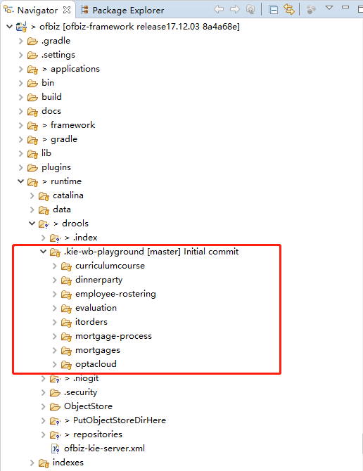

<br/>

**7. Why apply patches/kie/kie-server-services-common-7.17.0.Final.patch**

In this plugin, the default kie server id is set to runtime/drools/ofbiz-kie-server:

```groovy
rootProject.jvmArguments.add('-Dorg.kie.server.id=runtime/drools/ofbiz-kie-server')
```

The ofbiz-kie-server.xml is expected to be auto-created during first startup and stored under runtime/drools/, and afterwards loading configurations in new startup from it:

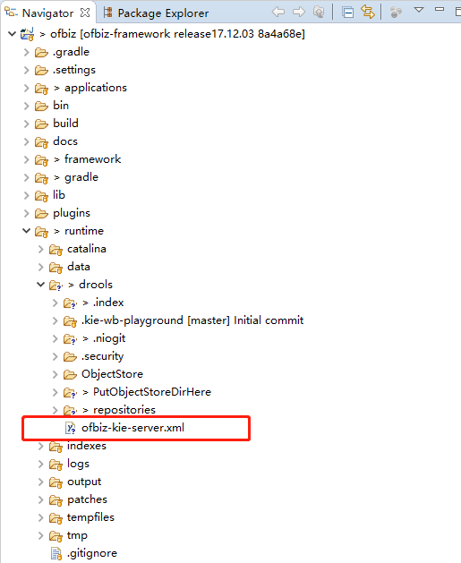

<br/>

And ofbiz-kie-server is expected as serverId so that it can be controlled in drools workbench:


<br/>

The above scenario is the reason to create this patch.

According to [Tomcat document](https://tomcat.apache.org/tomcat-9.0-doc/class-loader-howto.html), there are 2 types of class loader:

```text
Therefore, from the perspective of a web application, class or resource loading looks in the following repositories, in this order:

Bootstrap classes of your JVM
/WEB-INF/classes of your web application
/WEB-INF/lib/*.jar of your web application
System class loader classes (described above)
Common class loader classes (described above)

If the web application class loader is configured with <Loader delegate="true"/> then the order becomes:

Bootstrap classes of your JVM
System class loader classes (described above)
Common class loader classes (described above)
/WEB-INF/classes of your web application
/WEB-INF/lib/*.jar of your web application
```

<br/>

If your OFBiz is class loader type one, this patch is unnecessary as src/main/java/org/kie/server/services/impl/controller/DefaultRestControllerImpl.java will be built and deployed under /WEB-INF/classes.

If your OFBiz is type two and this is what I see in OFBiz 17.12.03, the patch can be applied to [droolsjbpm-integration/kie-server-parent/kie-server-services/kie-server-services-common](https://github.com/kiegroup/droolsjbpm-integration/tree/7.17.0.Final/kie-server-parent/kie-server-services/kie-server-services-common). The lib/kie-server-services-common-7.17.0.Final.jar is built with this patch.

<br/>

**8. Why gradle 5.6**

The gradle version in gradle/wrapper/gradle-wrapper.properties is 3.2.1. It has a problem to download files required by drools plugin properly and build Class-Path of MANIFEST.MF for ofbiz.jar correctly. In this case, it cannot resolve lucene version as expected. As we know, OFBiz use this Class-Path as classpath when starting. I happen to change 3.2.1 to 5.6 and it's ok. I guess many other gradle versions also work fine but I didn't try.

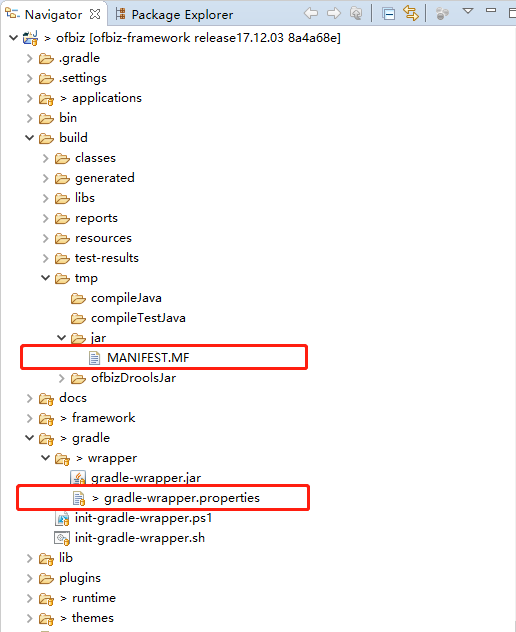

<br/>

**9. Why lib/juel-impl-no-osgi-2.2.7.jar**

The original version of juel-impl-2.2.7.jar is included in build.gradle:

```groovy
    compile 'de.odysseus.juel:juel-impl:2.2.7'
```

and it contains a services.xml under OSGI-INFO, the xml content is:

```xml
<?xml version="1.0" encoding="UTF-8"?>
<root xmlns:scr="http://www.osgi.org/xmlns/scr/v1.1.0">
    <scr:component name="de.odysseus.el.ExpressionFactoryImpl">
        <implementation class="de.odysseus.el.ExpressionFactoryImpl"/>
        <service>
            <provide interface="javax.el.ExpressionFactory"/>
        </service>
    </scr:component>
</root>
```

This OSGI config makes EL expressions in the jsp files error, so I unzipped the juel-impl-2.2.7.jar, removed OSGI-INFO and zip again, named the new jar to juel-impl-no-osgi-2.2.7.jar and placed it under lib folder. Then the jsp files work fine.

<br/>

**10. Why choose Kie 7.17.0.Final**

There are 2 reasons behind this decision:

The 1st reason is cdi-api 1.x. The 7.20.0.Final is the last version support cdi-api 1.x. All other latest versions require cdi-api 2.0. While in my test, under Tomcat 9.0.x, Kie with cdi-api 2.0 couldn't work. I found this [Tomcat cdi document](https://tomcat.apache.org/tomcat-9.0-doc/cdi.html), so I guess cdi-api 2.0 would be supported by Tomcat 9.5.x or later.

The 2nd reason is kie 7.17.0.Final is the latest version support cdi-api 1.x which can also build lucene index correctly and still work after restarts. All the other latest version will report lock error: **org.apache.lucene.store.LockObtainFailedException: Lock held by this virtual machine**

<br/>

**11. Don't forget to match Elasticsearch and Lucene version with ofbiz-plugins**

The lucene version in [OFBiz Lucene plugin 17.12.03](https://github.com/apache/ofbiz-plugins/blob/release17.12.03/lucene/build.gradle) is 7.1.0, which is newer than the version in kie, I changed several java files under src/main/java/org/uberfire/ext/ to match this version upgrade, and use Elasticsearch 6.1.1 accordingly.

<br/>

Thanks for reading this document.

--- END ---
